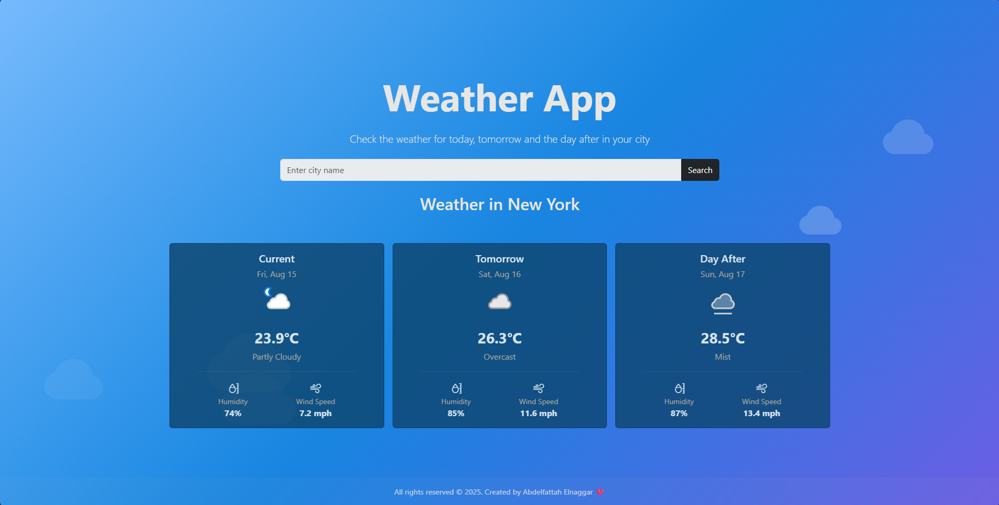

# 🌤️ Weather App

<div align="center">



**A beautiful and responsive weather application built with React and Vite**

[](https://reactjs.org/)
[](https://vitejs.dev/)
[](https://getbootstrap.com/)
[](LICENSE)

</div>

## ✨ Features

- 🌍 **Global Weather Search** - Get weather information for any city worldwide
- 📊 **3-Day Forecast** - View current weather and 3-day forecast
- 🎨 **Beautiful UI** - Modern, responsive design with Bootstrap
- ⚡ **Fast Performance** - Built with Vite for lightning-fast development and builds
- 🔍 **Smart Search** - Easy-to-use city search with error handling
- 📱 **Mobile Responsive** - Looks great on all devices
- 🌈 **Dynamic Backgrounds** - Beautiful background layouts that enhance the experience

## 🛠️ Tech Stack

- **Frontend Framework:** React 19.1.0
- **Build Tool:** Vite 7.0.4
- **Styling:** Bootstrap 5.3.7 + Bootstrap Icons
- **HTTP Client:** Axios
- **Date/Time:** Luxon
- **Alerts:** SweetAlert2
- **Weather API:** WeatherAPI.com

## 🚀 Getting Started

### Prerequisites

- Node.js (version 16 or higher)
- npm or yarn package manager

### Installation

1. **Clone the repository**
   ```bash
   git clone https://github.com/your-username/weather-app.git
   cd weather-app
   ```

2. **Install dependencies**
   ```bash
   npm install
   ```

3. **Set up environment variables**
   
   Create a `.env` file in the root directory:
   ```env
   VITE_WEATHER_API_KEY=your_weatherapi_key_here
   ```
   
   Get your free API key from [WeatherAPI.com](https://www.weatherapi.com/)

   **🚀 For Production Deployment:**
   - **Vercel:** Add environment variables in project settings
   - **Netlify:** Add in site settings → Environment variables  
   - **GitHub Pages:** Use GitHub Secrets in Actions
   - **Railway/Render:** Add in dashboard environment section

4. **Start the development server**
   ```bash
   npm run dev
   ```

5. **Open your browser**
   
   Navigate to `http://localhost:5173` to see the app running!

## 📋 Available Scripts

```bash
# Start development server
npm run dev

# Build for production
npm run build

# Preview production build locally
npm run preview

# Run ESLint
npm run lint
```

## 🚀 Deployment Guide

### **Step 1: Build Your Project**
```bash
npm run build
```

### **Step 2: Deploy to Your Platform**

#### **Vercel (Recommended)** ⚡
```bash
# Install Vercel CLI
npm i -g vercel

# Deploy
vercel

# Add environment variable
vercel env add VITE_WEATHER_API_KEY
```

#### **Netlify** 🌐
```bash
# Install Netlify CLI  
npm i -g netlify-cli

# Deploy
netlify deploy --prod --dir=dist

# Add environment variable in Netlify dashboard
```

#### **GitHub Pages** 📄
1. Push code to GitHub
2. Add `WEATHER_API_KEY` to repository secrets
3. Enable GitHub Actions workflow
4. Your app deploys automatically!

### **Step 3: Configure Environment Variables**
In your deployment platform dashboard, add:
- **Variable Name:** `VITE_WEATHER_API_KEY`
- **Variable Value:** Your WeatherAPI.com API key

⚠️ **Important:** Always add environment variables in your deployment platform, never commit `.env` files!

## 🏗️ Project Structure

```
weather-app/
├── public/                 # Static assets
├── src/
│   ├── Components/         # React components
│   │   ├── BackgroundLayout/
│   │   │   ├── BackgroundLayer.jsx
│   │   │   └── BackgroundLayer.css
│   │   ├── Weather/
│   │   │   ├── Weather.jsx
│   │   │   └── Weather.css
│   │   └── WeatherCards/
│   │       ├── WeatherCards.jsx
│   │       └── WeatherCards.css
│   ├── assets/            # Images and static files
│   ├── App.jsx           # Main App component
│   ├── main.jsx          # App entry point
│   └── index.css         # Global styles
├── package.json
├── vite.config.js
└── README.md
```

## 🎯 How It Works

1. **Search for a City**: Enter any city name in the search box
2. **View Current Weather**: See current temperature, conditions, and location
3. **Check Forecast**: View the next 3 days of weather forecast
4. **Error Handling**: Get friendly error messages for invalid cities or network issues

## 🌟 Key Components

### Weather Component
- Handles API calls to WeatherAPI
- Manages search functionality
- Displays current weather information

### WeatherCards Component
- Shows weather forecast cards
- Displays temperature, conditions, and dates
- Responsive card layout

### BackgroundLayer Component
- Provides beautiful background layouts
- Enhances visual appeal

## 🔧 Configuration

### Environment Variables

| Variable | Description | Required |
|----------|-------------|----------|
| `VITE_WEATHER_API_KEY` | Your WeatherAPI.com API key | Yes |

### API Integration

This app uses the [WeatherAPI.com](https://www.weatherapi.com/) service:
- **Endpoint**: `https://api.weatherapi.com/v1/forecast.json`
- **Features**: Current weather + 3-day forecast
- **Rate Limit**: Free tier allows 1 million calls per month

## 🎨 Customization

### Styling
- CSS files are located in each component folder
- Global styles in `src/index.css`
- Bootstrap classes used throughout for responsiveness

### Adding Features
- Extend forecast days in the API call
- Add more weather details (humidity, wind speed, etc.)
- Implement geolocation for current location weather

## 🤝 Contributing

1. Fork the repository
2. Create your feature branch (`git checkout -b feature/AmazingFeature`)
3. Commit your changes (`git commit -m 'Add some AmazingFeature'`)
4. Push to the branch (`git push origin feature/AmazingFeature`)
5. Open a Pull Request


## 🙏 Acknowledgments

- [WeatherAPI.com](https://www.weatherapi.com/) for providing the weather data
- [React](https://reactjs.org/) for the awesome framework
- [Vite](https://vitejs.dev/) for the blazing fast build tool
- [Bootstrap](https://getbootstrap.com/) for the beautiful UI components

## 📞 Contact

**Abdelfattah A. Elnaggar** - Frontend Developer

📱 **Mobile:** +201101791968  
💼 **LinkedIn:** [@abdelfattah-a-elnaggar](https://www.linkedin.com/in/abdelfattah-a-elnaggar-390413375/)  
🎓 **Program:** Route Frontend Diploma Student

Project Link: [https://github.com/your-username/weather-app](https://github.com/your-username/weather-app)

---

<div align="center">
  <p>Made with ❤️ by Abdelfattah</p>
  <p>Part of Route Frontend Diploma Program</p>
</div>